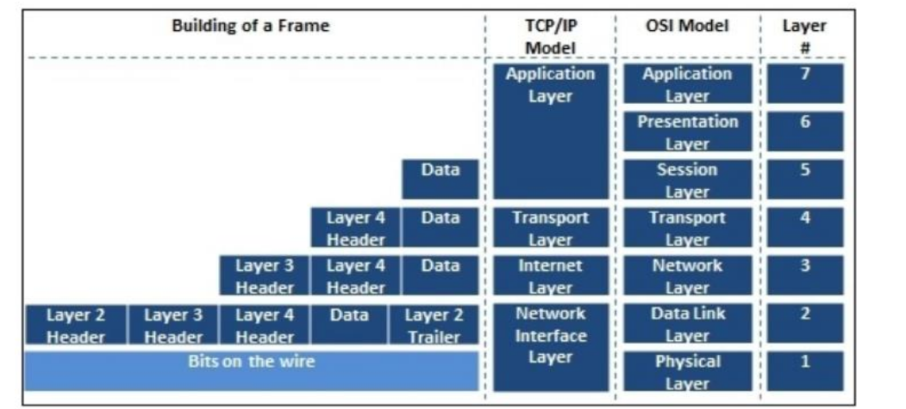
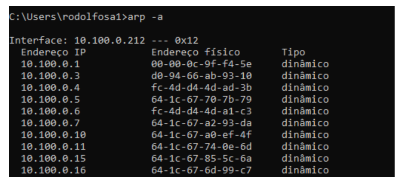
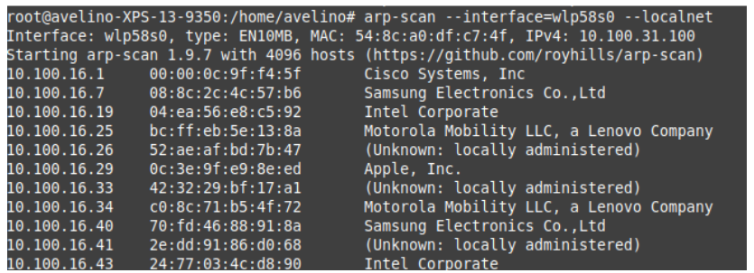
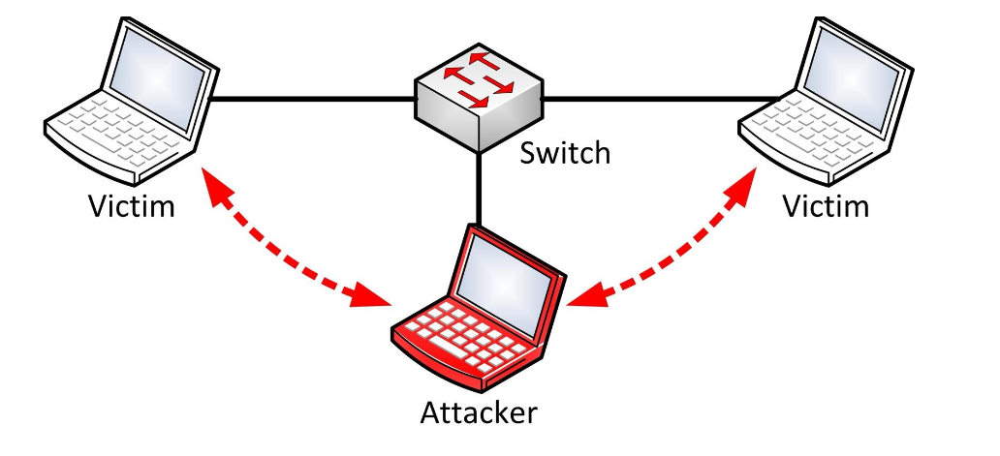
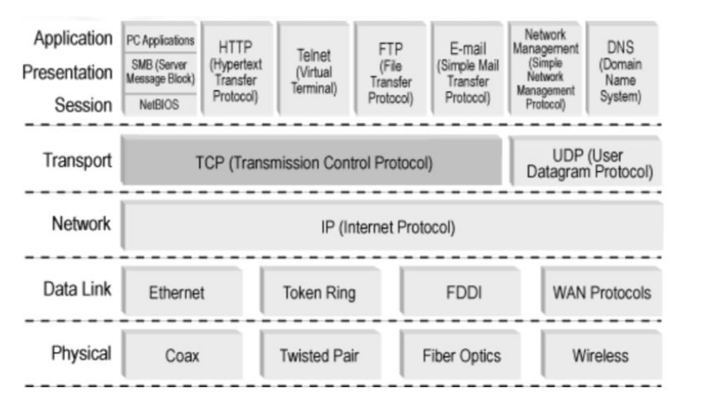
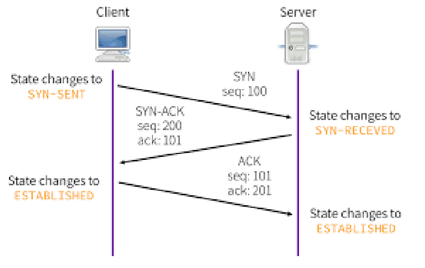
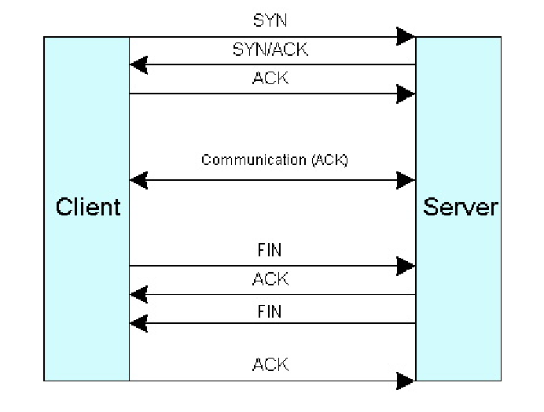
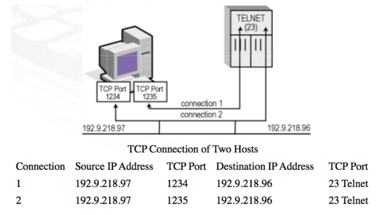
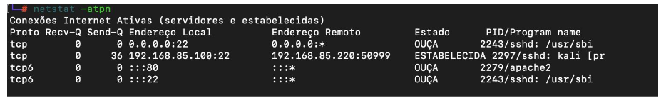
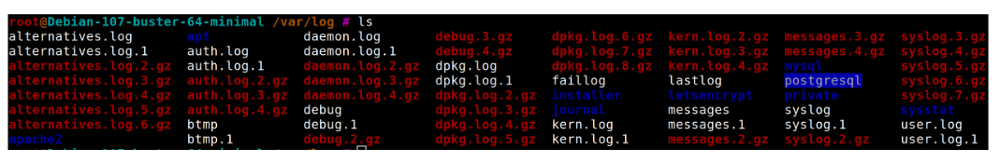

# Fundamentos de Comunicação de Dados

!!! info "Objetivos desta parte"
    - Entender como funciona a comunicação em redes locais.  
    - Conhecer protocolos e conceitos essenciais (Encapsulamento, ARP, MAC Address).  
    - Visualizar e manipular o cache ARP.  
    - Aprender técnicas de descoberta de hosts na rede.  
    - Introduzir o conceito e funcionamento do ARP Spoofing.

---

!!! info "Ferramentas de apoio"
    Para auxiliar no entendimento desta aula e na execução das práticas, recomendamos o uso das seguintes ferramentas: ping, traceroute, fping, arping e netdiscover.  
    Essas ferramentas permitem diagnosticar conectividade, mapear redes, identificar hosts ativos e complementar a análise de pacotes e logs.  
    Consulte a seção [**Ferramentas**](../ferramentas/diagnostico.md) no menu lateral para tutoriais completos de cada uma.

---

## Encapsulamento

O **encapsulamento** é o processo de adicionar informações de controle (cabeçalhos e trailers) aos dados à medida que eles passam pelas camadas do modelo de rede.  

Na comunicação:  
1. A camada de aplicação gera os dados.  
2. As camadas subsequentes adicionam informações de protocolo.  
3. Na camada física, os dados são transmitidos como sinais elétricos/ópticos ou ondas de rádio.  



!!! note 
    O diagrama mostra dados sendo encapsulados de cima para baixo no modelo de camadas (ex.: Aplicação → Transporte → Rede → Enlace → Física).

---

## Protocolo ARP (Address Resolution Protocol)

- O **ARP** é usado para encontrar o **endereço físico (MAC Address)** correspondente a um **endereço IP**.
- Ele envia um **broadcast** para toda a rede local solicitando:  
  “Quem tem o IP X.X.X.X?”
- O host que possui o IP responde com seu **par IP/MAC**.

**Funcionamento básico:**  
1. Host A quer se comunicar com Host B.  
2. Host A envia uma requisição ARP para toda a LAN.  
3. Host B responde com seu MAC Address.  
4. Host A armazena o par IP/MAC no **cache ARP**.  


## MAC Address

- Endereço físico de **48 bits**, geralmente representado como seis pares hexadecimais:  
  `54:8c:a0:df:c7:4f`
- É único para cada interface de rede.
- O ARP mantém um **cache** para evitar broadcasts desnecessários.
- Ao responder um broadcast, o host solicitante também envia seu par IP/MAC para que todos atualizem seus caches.


## Visualizando o Cache ARP

Comando para visualizar:
```bash
arp -a
```



## Descobrindo máquinas na rede

```bash
arp-scan --interface=wlp58s0 --localnet
```



--interface → especifica a interface de rede.

--localnet → escaneia toda a sub-rede local.

!!! tip "Dica"
    Ótimo para mapear dispositivos conectados na mesma LAN.

---

## Ataque ARP Spoofing

Técnica de ataque que engana o cache ARP de um host. Este ataque consiste em adicionar/substituir na tabela arp da máquina alvo uma entrada que aponte um IP do alvo para o MAC Address do atacante na tabela ARP da vítima.

O atacante envia respostas ARP falsas para associar seu MAC Address ao IP de outro dispositivo (ex.: gateway). É o método mais rápido de se estabelecer no meio da comunicação entre duas máquinas e interceptar as informações enviadas entre ambas.

Isso permite interceptar, alterar ou bloquear o tráfego entre as vítimas.



Exemplo de ataque:  
1. Atacante envia resposta ARP falsa ao Host A, dizendo que o IP do Gateway é o seu MAC.  
2. Atacante envia resposta ARP falsa ao Gateway, dizendo que o IP do Host A é o seu MAC.  
3. Agora, todo tráfego entre Host A e o Gateway passa pelo atacante.  

## Executando ARP Spoofing

```bash
arpspoof -i <INTERFACE> -t <IP_ALVO> <IP_GATEWAY>
```

-i → interface de rede usada no ataque.

-t → IP do alvo.

Último parâmetro → IP do gateway.

!!! danger "Atenção"
    - Ilegal sem autorização do dono da rede.
    - Deve ser usado apenas em ambiente de testes/laboratório.

---

## Relembrando as características do TCP e Conexões

!!! info "Objetivos desta parte"
    - Revisar as características do protocolo **TCP**.  
    - Entender o processo de **estabelecimento** e **finalização** de conexões (Three-Way Handshake).  
    - Compreender o conceito de **portas** e **sockets**.  
    - Aprender a visualizar e interpretar conexões abertas no sistema.

---


## Características do TCP



- Orientado à conexão (necessita handshake antes da troca de dados).
- Usa **sockets** para caracterizar cada conexão.
- Permite estabelecer parâmetros de **qualidade de serviço** e **segurança**.
- Negocia a conexão usando **Three-Way Handshake**.
- Possui mecanismos de:
  - **Entrega ordenada** de dados.
  - **Detecção e retransmissão** de pacotes perdidos.
  - **Término negociado** ou abrupto.
  - **Sinalização de dados urgentes**.
  - **Relato de falhas de serviço**.

## 🤝 Three-Way Handshake

Processo de **início** de conexão TCP:

1. **SYN** – Cliente envia pedido de conexão.
2. **SYN-ACK** – Servidor confirma recebimento e aceita conexão.
3. **ACK** – Cliente confirma e inicia troca de dados.



!!! note 
    O diagrama mostra setas representando as três etapas da negociação (SYN → SYN-ACK → ACK) entre cliente e servidor.

## 🛑 Encerramento de Conexão

Pode ser:  
- **Negociado** – com troca de mensagens FIN/ACK em ambos os lados.  
- **Abrupto** – com envio de pacote RST.  



## Portas TCP

A camada de transporte associa um identificador a cada processo de aplicação. Esse identificador é chamado de "Porta" ("port number").

- Identificadores numéricos usados para diferenciar serviços e processos.
- Faixa de **0 a 65535**:  
  - **0–1023**: portas conhecidas (*well-known ports*, ex.: 80 HTTP, 443 HTTPS, 22 SSH).  
  - **1024–49151**: portas registradas.  
  - **49152–65535**: portas dinâmicas/efêmeras. 

##  Sockets

Um socket é definido pela combinação de um endereço IP e uma porta, sendo escrito sob a forma "número IP:número da porta".

Um socket provê toda a informação de endereçamento que um cliente ou um servidor necessita para identificar seu parceiro na comunicação.

- Combinação **IP:Porta** que identifica uma conexão.
- Exemplo: `192.168.0.11:3389`
- Uma conexão TCP é identificada unicamente por **dois sockets** (um em cada ponta). 



--- 

### 🔍 Visualização de Conexões e Sockets – netstat



Para visualizar conexões de rede e sockets ativos no sistema, você pode utilizar a ferramenta **netstat**, localizada na aba ["Ferramentas"](../ferramentas/netstat.md) do curso. Ela permite identificar quais portas estão em uso, quais processos estão associados a cada conexão e se há serviços em escuta (*listening*). Essa visão é essencial para diagnosticar problemas de conectividade, detectar conexões suspeitas e monitorar o tráfego de rede em tempo real.

---

## Controle e Monitoramento de Portas com tcpdump

!!! info "Objetivos desta parte"
    - Entender a importância da captura de pacotes na análise de tráfego de rede.  
    - Compreender o papel do tcpdump como ferramenta de auditoria e diagnóstico.  
    - Relacionar a captura de pacotes com a detecção de problemas e ameaças.  


### Por que capturar pacotes?

A captura de pacotes permite:  
- **Monitorar a atividade de rede** em tempo real.  
- **Identificar padrões** de tráfego legítimo e malicioso.  
- **Detectar incidentes de segurança**, como varreduras de porta, tentativas de invasão e vazamento de dados.  
- **Diagnosticar problemas** de desempenho, latência e conectividade.  
- **Validar configurações** de firewall, roteamento e NAT.  


### O papel do tcpdump

O **tcpdump** é uma ferramenta que:  
- Funciona diretamente no terminal, sem necessidade de interface gráfica.  
- Captura pacotes que trafegam por uma interface de rede, mostrando informações do cabeçalho.  
- Permite aplicar filtros para registrar apenas o tráfego de interesse.  
- Gera arquivos `.pcap` que podem ser analisados posteriormente em ferramentas como o **Wireshark**.  

!!! note "Importante"
    Embora o tcpdump possa mostrar dados detalhados, nesta aula vamos focar em como interpretar as informações capturadas e entender o fluxo da comunicação, deixando a explicação aprofundada de comandos para a aba de **Ferramentas**.


### Interpretação geral de capturas

Ao analisar capturas, fique atento a:  
- **Endereço IP de origem e destino**.  
- **Portas utilizadas** (pode indicar o serviço).  
- **Flags TCP** (SYN, ACK, FIN, RST, PUSH) que indicam o estágio da conexão.  
- **Tamanho da janela** (window size) que pode indicar ajustes de desempenho.  
- **Volume e frequência de pacotes** para identificar comportamentos anômalos.  


### Aplicações práticas

Durante as aulas práticas, o tcpdump será usado para:  
- Monitorar conexões durante um **pentest**.  
- Analisar o tráfego antes, durante e depois de ataques simulados (ex.: ARP spoofing).  
- Validar se regras de firewall estão bloqueando ou permitindo o tráfego como esperado.  
- Coletar evidências para exercícios de **análise forense**.  


### Conexão com próximos tópicos

A captura e análise de pacotes será um **ponto de transição** para:  
- Estudo de **análise de logs**.  
- Compreensão de **tráfego normal vs tráfego malicioso**.  
- Identificação de **padrões de ataque** que podem ser detectados tanto em capturas quanto em registros de log.  

---

!!! tip "Saiba mais"
    Para detalhes sobre instalação, execução, filtros e exemplos de uso do tcpdump, consulte a [**seção Ferramentas → tcpdump**](../ferramentas/tcpdump.md) no menu lateral.

---

## Análise de Logs

!!! info "Objetivos desta parte"
    - Entender a importância da análise de logs na segurança da informação.  
    - Reconhecer diferentes tipos de logs e suas aplicações.  
    - Saber identificar padrões e anomalias a partir de registros.  
    - Relacionar eventos registrados a possíveis incidentes de segurança.  


### O que são logs?

Logs são registros automáticos de eventos gerados por sistemas, aplicações, dispositivos de rede e ferramentas de segurança.  
Eles contêm informações cruciais para:    
- **Auditoria** – comprovar ações executadas no sistema.      
- **Monitoramento** – acompanhar a operação de serviços e aplicações.    
- **Investigação** – identificar causas de falhas ou incidentes de segurança.    

### Importância na Segurança da Informação

A análise de logs e conexões de rede é fundamental para:  
- **Identificar atividades maliciosas** – tentativas de intrusão, execução de malware, ataques DDoS etc.    
- **Resolver problemas** – diagnosticar falhas, quedas de serviço e gargalos.    
- **Otimizar desempenho** – identificar padrões de uso e ajustar configurações.    
- **Planejamento** – prever necessidade de upgrades e melhorias.    

### Tipos de logs

Exemplos comuns:  
- **Logs de firewall** – conexões permitidas e bloqueadas, alertas de ataques.    
- **Logs de servidores web** – acessos, erros HTTP, requisições suspeitas.    
- **Logs de servidores de aplicação** – falhas internas, tempo de resposta.    
- **Logs de sistema operacional** – autenticações, erros de hardware/software.    
- **Logs de IDS/IPS** – detecção e bloqueio de ataques.  

### 📍 Localização dos logs no Linux

No Linux, a maioria dos logs é armazenada em `/var/log/`



Dentro deste diretório, cada serviço ou aplicação pode ter seu próprio arquivo de log, por exemplo:  
- `/var/log/syslog`  
- `/var/log/auth.log`  
- `/var/log/apache2/access.log`  
- `/var/log/apache2/error.log`  

### Interpretando logs

Ao analisar, procure:  
- **Padrões e tendências** (ex.: acessos fora do horário habitual).   
- **Eventos incomuns ou suspeitos** (ex.: muitos erros de autenticação).    
- **Tráfego suspeito** (ex.: requisições repetidas para páginas não existentes).  

### Conexão com outras práticas

A análise de logs complementa:  
- **Monitoramento de pacotes** (tcpdump, Wireshark).    
- **Configuração de firewalls** (iptables, ufw).    
- **Sistemas de detecção de intrusão** (Snort, Suricata).    


---

## Exemplos de ataques em logs de servidor web

- Tentativas de acessar `/phpmyadmin/` ou `/scripts/setup.php` (busca por painéis administrativos).  
- Requisições com métodos incomuns como `PROPFIND`.  
- Códigos de status HTTP fora do padrão esperado.

!!! note "Códigos de status HTTP"
    - **1xx** – Informações  
    - **2xx** – Sucesso  
    - **3xx** – Redirecionamento  
    - **4xx** – Erro do cliente  
    - **5xx** – Erro do servidor  


Exemplo de ataque brute force SSH:

```bash
Oct 2 06:25:46 host-vps sshd[8463]: Failed password for root from 116.31.116.17 port 31142 ssh2  
Oct 2 06:25:48 host-vps sshd[8463]: Failed password for root from 116.31.116.17 port 31142 ssh2  
Oct 2 06:25:51 host-vps sshd[8463]: Failed password for root from 116.31.116.17 port 31142 ssh2   
Oct 2 06:25:51 host-vps sshd[8463]: Received disconnect from 116.31.116.17: 11: [preauth]  
```

Exemplo de ataque web server:  

```bash
191.96.249.97 - - [20/Apr/2017:15:45:49 +0200] "GET /phpmyadmin/scripts/setup.php HTTP/1.0" 404 162 "-" "-" "-"
190.129.24.154 - - [14/Jul/2015:06:41:59 -0400] "GET /phpMyAdmin/index.php HTTP/1.1" 404 162 "-" "Python-urllib/2.6" "-"
190.129.24.154 - - [20/Apr/2017:09:04:47 +0200] "PROPFIND /webdav/ HTTP/1.1" 405 166 "-" "WEBDAV Client" "-"
180.97.106.37 - - [20/Apr/2017:04:31:02 +0200] "\x04\x01\x00P\xB4\xA3qR\x00" 400 166 "-" "-" "-"
```

---


