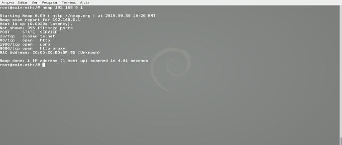
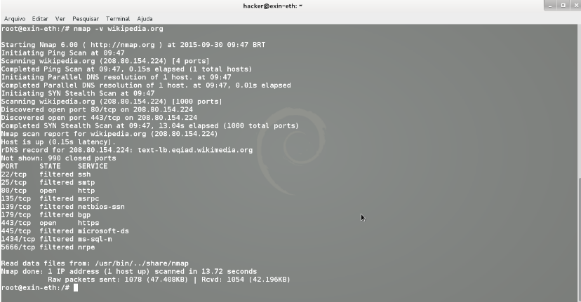
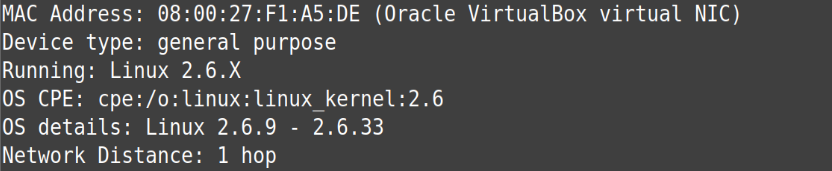

## **Reconhecendo o alvo com o NMAP**

Pode ser considerada uma das ferramentas mais completas para realizar varredura em redes, pois disponibiliza um grande número de opções, possibilitando realizarmos diversas varreduras em busca de vulnerabilidades e características do alvo. Essa ferramenta possui, inclusive, opções que permitem burlar sistemas de proteção, como IDS/IPS e Firewall, cujas regras poderiam bloquear ou detectar varreduras não permitidas.

Ela localiza e identifica todas as portas TCP e UDP disponíveis em um host, tentando determinar qual o serviço que está “escutando” em cada porta e é capaz de identificar o tipo de sistema operacional em execução. O Nmap é visto como uma ferramenta de segurança, usada para descobrir “brechas” em sistemas, ajudando na tarefa de monitoração e gerenciamento da rede e identificação de serviços rodando em servidores.

**Sintaxe:**

**nmap [Scan Type(s)] [Options] {target specification}**



No exemplo da figura ele foi executado de forma simples, apenas indicando o IP do alvo. Como resposta é exibido as portas e serviços disponíveis no host.

Usando o modo "verbose" "-v" para exibir mais informações do alvo. Utilize "-vv" para ter uma saída com informações mais detalhadas.



---

## **Alguns exemplos de comandos nmap**

Primeiramente, descubra qual o número IP de sua máquina hospedeira. Lembre-se que a interface virtual do seu Kali Linux deverá estar configurada em modo "Bridge".

Para efeitos de exemplo, assume-se que o IP da máquina hospedeira seja **192.168.68.109**. Lembre de alterá-lo para o número de sua máquina quando for executar algum comando.

### **Exemplo 1: Descobrindo as portas abertas de um host**

Vamos descobrir quais portas de comunicação TCP estão abertas no alvo.

```bash
nmap -sT 192.168.68.109
```


A opção **`-s`** no script é o comando para o escaneamento. Já a opção **`T`** indica o escaneamento de portas TCP. Caso seja necessário escanear as portas UDP, altere o **`T`** para **`U`**.

A saída do comando apresentada na figura exibe 3 colunas:  
1. Número da porta aberta  
2. Estado da porta  
3. Possível serviço que está sendo executado nesta porta  

Estado das portas:

- **Aberta (open)** – Está ativamente aceitando conexões TCP ou pacotes UDP nesta porta.
- **Fechada (closed)** – Uma porta fechada está acessível (recebe e responde a pacotes de sondagens do Nmap), mas não há nenhuma aplicação ouvindo nela.
- **Filtrada (filtered)** – O Nmap não consegue determinar se a porta está aberta porque uma filtragem de pacotes impede que as sondagens alcancem a porta.

### **Exemplo 2: Descobrindo as versões dos serviços em execução**

```bash
nmap -sV 192.168.68.109
```


Observe que na saída do comando é acrescentada uma quarta coluna, onde a versão do serviço em execução é apresentado.

### **Exemplo 3: Descobrindo o Sistema Operacional**

```bash
nmap -O 192.168.68.109
```



A opção "-O" tenta descobrir qual a versão do sistema operacional do host alvo.

### **Exemplo 4: Selecionando as portas a serem escaneadas**

É possível escolher uma ou várias portas a serem escaneadas. Para isso, usa-se a opção "-p". No primeiro exemplo vamos escanear apenas a porta 80, já no segundo exemplo iremos escanear as portas 445 e 22.

```bash
nmap -sV -p 80 192.168.68.109
```


```bash
nmap -sV -p 445,22 192.168.68.109
```


---

## Nmap Scripting Engine (NSE)

Oferece um conjunto totalmente novo de recursos e confere uma nova dimensão para o Nmap.  
Permite que o Nmap conclua uma série de tarefas, incluindo *scanning* de vulnerabilidades, detecção de *backdoors* e, em alguns casos, a exploração de vulnerabilidades.

A seguir, são apresentados alguns exemplos e exercícios para a prática do Nmap:

### Para descoberta de vulnerabilidades

```bash
nmap -sV --script vuln 192.168.68.109
```

### Encontrar malware ou backdoor

```bash
nmap -v --script malware 192.168.68.109
```

---

## Cheatsheet NMAP

